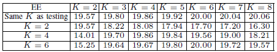
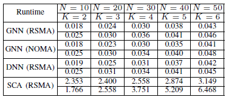

#  Energy-Efficient Multi-RIS-Aided Rate-Splitting Multiple Access: A Graph Neural Network Approach

## Introduction:
This is implementation of energy efficiency (EE) maximization in a downlink multiple-input single-output (MISO) reconfigurable intelligent surface (RIS)-aided multiuser system employing rate-splitting multiple access (RSMA). The optimization task entails base station (BS) and RIS beamforming and RSMA common rate allocation with constraints. We propose a graph neural network (GNN) model that learns beamforming and rate allocation directly from the channel information using a unique graph representation derived from the communication system.

This code is for paper : 
B.-J. Chen, R. Y. Chang, F.-T. Chien, and H. V. Poor, "Energy-Efficient Multi-RIS-Aided Rate-Splitting Multiple Access: A Graph Neural Network Approach," IEEE Wireless Communications Letters, to be published.

## Dataset:
Quasi-static Rician flat-fading and quasi-static Rayleigh flat-fading channel model

## Conception:
### system setup

### model structure

## Execution:
To implement RSMA and NOMA scheme, enter the desired directory based on the folder name then

`python trainer.py`

The system parameters can be altered in the main function of trainer.py.

To implement SCA (model-based method) in RSMA scheme, enter the model_based folder and then

`python model_based.py`

To implement DRL in RSMA scheme, enter the DRL folder and then

`python DRL.py`

## Experiement Result:

### Experiemnt 1

### Experiemnt 2

### Generalizability

### Run time

## Dependencies:

- python==3.9.7
- torch==1.9.0+cu102
- numpy==1.21.1
- sklearn==0.24.2

## Contact:
Bing-Jia Chen, r11942023@ntu.edu.tw
